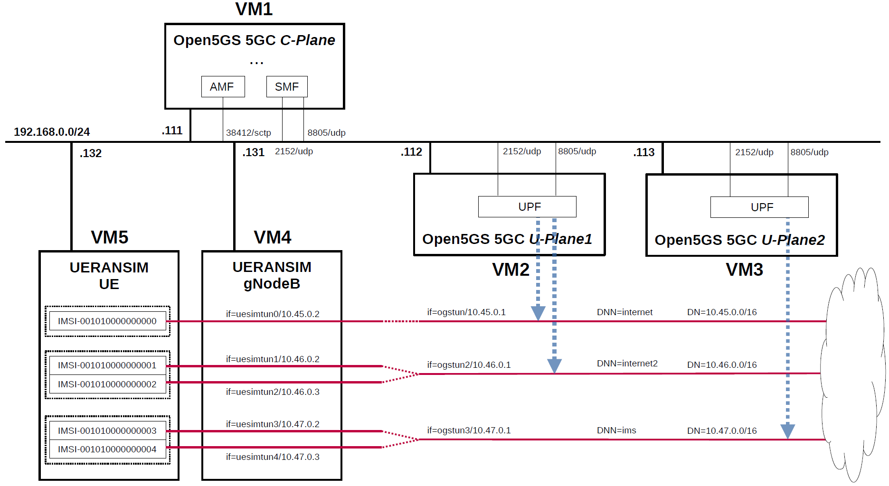

# Open5GS 5GC & UERANSIM UE / RAN Sample Configuration
UERANSIM (5G UE & RAN (gNodeB) simulator) supports IPv4 of PDU Session Type from 2020.11.17 version, and the Data Plane facility has been enabled.
Therefore, in order to use U-Plane's DN (Data Network) as a trial, I built a simulation environment for the 5GC mobile network.
This briefly describes the overall and configuration files.

---

<h2 id="toc">Table of Contents</h2>

- [Overview of Open5GS 5GC Simulation Mobile Network](#overview)
- [Changes in configuration files of Open5GS 5GC and UERANSIM UE / RAN](#changes)
  - [Changes in configuration files of Open5GS 5GC C-Plane](#changes_cp)
  - [Changes in configuration files of Open5GS 5GC U-Plane1](#changes_up1)
  - [Changes in configuration files of Open5GS 5GC U-Plane2](#changes_up2)
  - [Changes in configuration files of UERANSIM UE / RAN](#changes_ueransim)
    - [Changes in configuration files of UE0 (IMSI-001010000000000) & RAN on VM4](#changes_ue0)
    - [Changes in configuration files of UE1 (IMSI-001010000000001) & RAN on VM5](#changes_ue1)
    - [Changes in configuration files of UE2 (IMSI-001010000000002) & RAN on VM6](#changes_ue2)
    - [Changes in configuration files of UE3 (IMSI-001010000000003) & RAN on VM7](#changes_ue3)
    - [Changes in configuration files of UE4 (IMSI-001010000000004) & RAN on VM8](#changes_ue4)
- [Network settings of Open5GS 5GC and UERANSIM UE / RAN](#network_settings)
  - [Network settings of Open5GS 5GC U-Plane1](#network_settings_up1)
  - [Network settings of Open5GS 5GC U-Plane2](#network_settings_up2)
- [Build Open5GS and UERANSIM](#build)
- [Run Open5GS 5GC and UERANSIM UE / RAN](#run)
  - [Run Open5GS 5GC C-Plane](#run_cp)
  - [Run Open5GS 5GC U-Plane1 & U-Plane2](#run_up)
  - [Run UERANSIM](#run_ueran)
    - [NG-Setup between gNodeB and 5GC and initialize UE & gNodeB](#ngsetup)
    - [Register UE with 5GC and establish a PDU session](#register_and_pdu_session_establishment)
    - [Configure the TUNnel interface of UERANSIM](#config_tun)
    - [Start the TUN Agent of UERANSIM](#start_tun)
- [Ping google.com](#ping)
  - [Case for going through DN 10.45.0.0/16](#ping_1)

---
<h2 id="overview">Overview of Open5GS 5GC Simulation Mobile Network</h2>

I created a 5GC mobile network (Internet reachable) for simulation with the aim of creating an environment in which packets can be sent end-to-end with different DNs for each APN.

The following minimum configuration was set as a condition.
- C-Plane have multiple U-Planes.
- U-Plane have multiple DNs.
- Multiple UEs connect to same DN.

The built simulation environment is as follows.

</img>

The 5GC / UE / RAN used are as follows.
- 5GC - Open5GS v2.0.22 or later - https://github.com/open5gs/open5gs
- UE / RAN - UERANSIM v1.0.9 or later - https://github.com/aligungr/UERANSIM

Each VMs are as follows.  
| VM # | SW & Role | IP address | OS | Memory (Min) | HDD (Min) |
| --- | --- | --- | --- | --- | --- |
| VM1 | Open5GS 5GC C-Plane | 192.168.0.111/24 | Ubuntu 20.04 | 1GB | 20GB |
| VM2 | Open5GS 5GC U-Plane1  | 192.168.0.112/24 | Ubuntu 20.04 | 1GB | 20GB |
| VM3 | Open5GS 5GC U-Plane2  | 192.168.0.113/24 | Ubuntu 20.04 | 1GB | 20GB |
| VM4 | UERANSIM UE / RAN | 192.168.0.131/24 | Ubuntu 20.04 | 1GB | 10GB |
| VM5 | UERANSIM UE / RAN | 192.168.0.132/24 | Ubuntu 20.04 | 1GB | 10GB |
| VM6 | UERANSIM UE / RAN | 192.168.0.133/24 | Ubuntu 20.04 | 1GB | 10GB |
| VM7 | UERANSIM UE / RAN | 192.168.0.134/24 | Ubuntu 20.04 | 1GB | 10GB |
| VM8 | UERANSIM UE / RAN | 192.168.0.135/24 | Ubuntu 20.04 | 1GB | 10GB |

Subscriber Information (other information is the same) is as follows.  
| UE # | IMSI | APN | OP/OPc |
| --- | --- | --- | --- |
| UE0 | 001010000000000 | internet | OP |
| UE1 | 001010000000001 | internet2 | OP |
| UE2 | 001010000000002 | internet2 | OP |
| UE3 | 001010000000003 | ims | OP |
| UE4 | 001010000000004 | ims | OP |

I registered these information with the Open5GS WebUI.

Each DNs are as follows.
| DN | TUNnel interface of DN | APN | TUNnel interface of UE | U-Plane # |
| --- | --- | --- | --- | --- |
| 10.45.0.0/16 | ogstun | internet | uesimtun | U-Plane1 |
| 10.46.0.0/16 | ogstun2 | internet2 | uesimtun | U-Plane1 |
| 10.47.0.0/16 | ogstun3 | ims | uesimtun | U-Plane2 |

Additional information.

Open5GS 5GC U-Plane worked fine on Raspberry Pi 4 Model B. I used [Ubuntu 20.04 (64bit) for Raspberry Pi 4](https://ubuntu.com/download/raspberry-pi) as the OS. I think it would be convenient to place a compact U-Plane in the edge environment and use it as an end-point for DN.

In addition, I have not confirmed the communication performance.

<h2 id="changes">Changes in configuration files of Open5GS 5GC and UERANSIM UE / RAN</h2>

Please refer to the following for building Open5GS and UERANSIM respectively.
- Open5GS v2.0.22 or later - https://open5gs.org/open5gs/docs/guide/02-building-open5gs-from-sources/
- UERANSIM v1.0.9 or later - https://github.com/aligungr/UERANSIM/wiki/Installation-and-Usage

<h3 id="changes_cp">Changes in configuration files of Open5GS 5GC C-Plane</h3>

The following parameters including APN can be used in the logic that selects UPF as the connection destination by PFCP.

- APN
- TAC (Tracking Area Code)
- nr_CellID

For the sake of simplicity, I used only APN this time. Please refer to [here](https://github.com/open5gs/open5gs/pull/560#issue-483001043) for the logic to select UPF.

- `open5gs/install/etc/open5gs/amf.yaml`
```diff
--- amf.yaml.orig       2020-11-27 13:44:15.729869224 +0000
+++ amf.yaml    2020-11-24 17:12:56.000000000 +0000
@@ -165,25 +165,26 @@
       - addr: 127.0.0.5
         port: 7777
     ngap:
-      - addr: 127.0.0.5
+      - addr: 192.168.0.111
     guami:
       - plmn_id:
-          mcc: 901
-          mnc: 70
+          mcc: 001
+          mnc: 01
         amf_id:
           region: 2
           set: 1
     tai:
       - plmn_id:
-          mcc: 901
-          mnc: 70
+          mcc: 001
+          mnc: 01
         tac: 1
     plmn_support:
       - plmn_id:
-          mcc: 901
-          mnc: 70
+          mcc: 001
+          mnc: 01
         s_nssai:
           - sst: 1
+            sd: 010203
     security:
         integrity_order : [ NIA2, NIA1, NIA0 ]
         ciphering_order : [ NEA0, NEA1, NEA2 ]
```
- `open5gs/install/etc/open5gs/smf.yaml`
```diff
--- smf.yaml.orig       2020-11-27 13:44:15.697869141 +0000
+++ smf.yaml    2020-11-27 13:55:44.000000000 +0000
@@ -175,11 +175,18 @@
       - addr: 127.0.0.4
       - addr: ::1
     pfcp:
-      - addr: 127.0.0.4
+      - addr: 192.168.0.111
       - addr: ::1
     pdn:
       - addr: 10.45.0.1/16
-      - addr: cafe::1/64
+        apn: internet
+        dev: ogstun
+      - addr: 10.46.0.1/16
+        apn: internet2
+        dev: ogstun2
+      - addr: 10.47.0.1/16
+        apn: ims
+        dev: ogstun3
     dns:
       - 8.8.8.8
       - 8.8.4.4
@@ -275,7 +282,10 @@
 #
 upf:
     pfcp:
-      - addr: 127.0.0.7
+      - addr: 192.168.0.112
+        apn: [internet, internet2]
+      - addr: 192.168.0.113
+        apn: ims
 
 #
 # parameter:
```

<h3 id="changes_up1">Changes in configuration files of Open5GS 5GC U-Plane1</h3>

- `open5gs/install/etc/open5gs/upf.yaml`
```diff
--- upf.yaml.orig       2020-11-27 13:53:56.993456263 +0000
+++ upf.yaml    2020-11-24 16:44:30.000000000 +0000
@@ -163,12 +163,16 @@
 #
 upf:
     pfcp:
-      - addr: 127.0.0.7
+      - addr: 192.168.0.112
     gtpu:
-      - addr: 127.0.0.7
+      - addr: 192.168.0.112
     pdn:
       - addr: 10.45.0.1/16
-      - addr: cafe::1/64
+        apn: internet
+        dev: ogstun
+      - addr: 10.46.0.1/16
+        apn: internet2
+        dev: ogstun2
 
 #
 # smf:
```

<h3 id="changes_up2">Changes in configuration files of Open5GS 5GC U-Plane2</h3>

- `open5gs/install/etc/open5gs/upf.yaml`
```diff
--- upf.yaml.orig       2020-11-23 08:20:22.000000000 +0000
+++ upf.yaml    2020-11-24 16:45:48.000000000 +0000
@@ -163,12 +163,13 @@
 #
 upf:
     pfcp:
-      - addr: 127.0.0.7
+      - addr: 192.168.0.113
     gtpu:
-      - addr: 127.0.0.7
+      - addr: 192.168.0.113
     pdn:
-      - addr: 10.45.0.1/16
-      - addr: cafe::1/64
+      - addr: 10.47.0.1/16
+        apn: ims
+        dev: ogstun3
 
 #
 # smf:
```

<h3 id="changes_ueransim">Changes in configuration files of UERANSIM UE / RAN</h3>

<h4 id="changes_ue0">Changes in configuration files of UE0 (IMSI-001010000000000) & RAN on VM4</h4>

- `UERANSIM/config/open5gs/gnb.yaml`
```diff
--- gnb.yaml.orig       2020-11-28 22:02:01.292709319 +0000
+++ gnb.yaml    2020-11-28 22:05:54.480471464 +0000
@@ -2,19 +2,19 @@
 tac: 1
 nci: '0000000100'
 
-host: 127.0.0.1
+host: 192.168.0.131
 gtpPort: 2152
 
 plmn:
-  mcc: 901
-  mnc: 70
+  mcc: 001
+  mnc: 01
 
 amfConfigs:
-  - host: 127.0.0.5
+  - host: 192.168.0.111
     port: 38412
 
 nssais:
   - sst: '0x01'
     sd: '0x010203'
 
-ignoreStreamIds: true
\ No newline at end of file
+ignoreStreamIds: true
```
- `UERANSIM/config/open5gs/ue.yaml`
```diff
--- ue.yaml.orig        2020-11-24 16:48:26.000000000 +0000
+++ ue.yaml     2020-11-24 16:51:56.000000000 +0000
@@ -2,10 +2,10 @@
 op: 'E8ED289DEBA952E4283B54E88E6183CA'
 amf: '8000'
 imei: '356938035643803'
-supi: 'imsi-901700000000003'
+supi: 'imsi-001010000000000'
 plmn:
-  mcc: 901
-  mnc: 70
+  mcc: 001
+  mnc: 01
 
 smsOverNasSupported: true
 dnn: 'internet'
```

<h4 id="changes_ue1">Changes in configuration files of UE1 (IMSI-001010000000001) & RAN on VM5</h4>

- `UERANSIM/config/open5gs/gnb.yaml`
```diff
--- gnb.yaml.orig       2020-11-28 22:02:01.292709319 +0000
+++ gnb.yaml    2020-11-28 22:53:38.523552476 +0000
@@ -2,19 +2,19 @@
 tac: 1
 nci: '0000000100'
 
-host: 127.0.0.1
+host: 192.168.0.132
 gtpPort: 2152
 
 plmn:
-  mcc: 901
-  mnc: 70
+  mcc: 001
+  mnc: 01
 
 amfConfigs:
-  - host: 127.0.0.5
+  - host: 192.168.0.111
     port: 38412
 
 nssais:
   - sst: '0x01'
     sd: '0x010203'
 
-ignoreStreamIds: true
\ No newline at end of file
+ignoreStreamIds: true
```
- `UERANSIM/config/open5gs/ue.yaml`
```diff
--- ue.yaml.orig        2020-11-24 16:48:26.000000000 +0000
+++ ue.yaml     2020-11-24 16:56:36.000000000 +0000
@@ -2,13 +2,13 @@
 op: 'E8ED289DEBA952E4283B54E88E6183CA'
 amf: '8000'
 imei: '356938035643803'
-supi: 'imsi-901700000000003'
+supi: 'imsi-001010000000001'
 plmn:
-  mcc: 901
-  mnc: 70
+  mcc: 001
+  mnc: 01
 
 smsOverNasSupported: true
-dnn: 'internet'
+dnn: 'internet2'
 
 requestedNssai:
   - sst:
```

<h4 id="changes_ue2">Changes in configuration files of UE2 (IMSI-001010000000002) & RAN on VM6</h4>

- `UERANSIM/config/open5gs/gnb.yaml`
```diff
--- gnb.yaml.orig       2020-11-28 22:02:01.292709319 +0000
+++ gnb.yaml    2020-11-28 22:54:49.234937288 +0000
@@ -2,19 +2,19 @@
 tac: 1
 nci: '0000000100'
 
-host: 127.0.0.1
+host: 192.168.0.133
 gtpPort: 2152
 
 plmn:
-  mcc: 901
-  mnc: 70
+  mcc: 001
+  mnc: 01
 
 amfConfigs:
-  - host: 127.0.0.5
+  - host: 192.168.0.111
     port: 38412
 
 nssais:
   - sst: '0x01'
     sd: '0x010203'
 
-ignoreStreamIds: true
\ No newline at end of file
+ignoreStreamIds: true
```
- `UERANSIM/config/open5gs/ue.yaml`
```diff
--- ue.yaml.orig        2020-11-24 16:48:26.000000000 +0000
+++ ue.yaml     2020-11-28 09:04:13.232768088 +0000
@@ -2,13 +2,13 @@
 op: 'E8ED289DEBA952E4283B54E88E6183CA'
 amf: '8000'
 imei: '356938035643803'
-supi: 'imsi-901700000000003'
+supi: 'imsi-001010000000002'
 plmn:
-  mcc: 901
-  mnc: 70
+  mcc: 001
+  mnc: 01
 
 smsOverNasSupported: true
-dnn: 'internet'
+dnn: 'internet2'
 
 requestedNssai:
   - sst:
```

<h4 id="changes_ue3">Changes in configuration files of UE3 (IMSI-001010000000003) & RAN on VM7</h4>

- `UERANSIM/config/open5gs/gnb.yaml`
```diff
--- gnb.yaml.orig       2020-11-28 22:02:01.292709319 +0000
+++ gnb.yaml    2020-11-28 22:55:27.390605367 +0000
@@ -2,19 +2,19 @@
 tac: 1
 nci: '0000000100'
 
-host: 127.0.0.1
+host: 192.168.0.134
 gtpPort: 2152
 
 plmn:
-  mcc: 901
-  mnc: 70
+  mcc: 001
+  mnc: 01
 
 amfConfigs:
-  - host: 127.0.0.5
+  - host: 192.168.0.111
     port: 38412
 
 nssais:
   - sst: '0x01'
     sd: '0x010203'
 
-ignoreStreamIds: true
\ No newline at end of file
+ignoreStreamIds: true
```
- `UERANSIM/config/open5gs/ue.yaml`
```diff
--- ue.yaml.orig        2020-11-24 16:48:26.000000000 +0000
+++ ue.yaml     2020-11-24 16:55:50.000000000 +0000
@@ -2,13 +2,13 @@
 op: 'E8ED289DEBA952E4283B54E88E6183CA'
 amf: '8000'
 imei: '356938035643803'
-supi: 'imsi-901700000000003'
+supi: 'imsi-001010000000003'
 plmn:
-  mcc: 901
-  mnc: 70
+  mcc: 001
+  mnc: 01
 
 smsOverNasSupported: true
-dnn: 'internet'
+dnn: 'ims'
 
 requestedNssai:
   - sst:
```

<h4 id="changes_ue4">Changes in configuration files of UE4 (IMSI-001010000000004) & RAN on VM8</h4>

- `UERANSIM/config/open5gs/gnb.yaml`
```diff
--- gnb.yaml.orig       2020-11-28 22:02:01.292709319 +0000
+++ gnb.yaml    2020-11-28 22:55:56.074355837 +0000
@@ -2,19 +2,19 @@
 tac: 1
 nci: '0000000100'
 
-host: 127.0.0.1
+host: 192.168.0.135
 gtpPort: 2152
 
 plmn:
-  mcc: 901
-  mnc: 70
+  mcc: 001
+  mnc: 01
 
 amfConfigs:
-  - host: 127.0.0.5
+  - host: 192.168.0.111
     port: 38412
 
 nssais:
   - sst: '0x01'
     sd: '0x010203'
 
-ignoreStreamIds: true
\ No newline at end of file
+ignoreStreamIds: true
```
- `UERANSIM/config/open5gs/ue.yaml`
```diff
--- ue.yaml.orig        2020-11-24 16:48:26.000000000 +0000
+++ ue.yaml     2020-11-27 14:06:33.000000000 +0000
@@ -2,13 +2,13 @@
 op: 'E8ED289DEBA952E4283B54E88E6183CA'
 amf: '8000'
 imei: '356938035643803'
-supi: 'imsi-901700000000003'
+supi: 'imsi-001010000000004'
 plmn:
-  mcc: 901
-  mnc: 70
+  mcc: 001
+  mnc: 01
 
 smsOverNasSupported: true
-dnn: 'internet'
+dnn: 'ims'
 
 requestedNssai:
   - sst:
```

<h2 id="network_settings">Network settings of Open5GS 5GC and UERANSIM UE / RAN</h2>

<h3 id="network_settings_up1">Network settings of Open5GS 5GC U-Plane1</h3>

First, uncomment the next line in the `/etc/sysctl.conf` file and reflect it in the OS.
```
net.ipv4.ip_forward=1
```
```
# sysctl -p
```
Next, configure the TUNnel interface and NAPT.
```
ip tuntap add name ogstun mode tun
ip addr add 10.45.0.1/16 dev ogstun
ip addr add cafe::1/64 dev ogstun
ip link set ogstun up

iptables -t nat -A POSTROUTING -s 10.45.0.0/16 ! -o ogstun -j MASQUERADE

ip tuntap add name ogstun2 mode tun
ip addr add 10.46.0.1/16 dev ogstun2
ip addr add cafe::2/64 dev ogstun2
ip link set ogstun2 up

iptables -t nat -A POSTROUTING -s 10.46.0.0/16 ! -o ogstun2 -j MASQUERADE
```

<h3 id="network_settings_up2">Network settings of Open5GS 5GC U-Plane2</h3>

First, uncomment the next line in the `/etc/sysctl.conf` file and reflect it in the OS.
```
net.ipv4.ip_forward=1
```
```
# sysctl -p
```
Next, configure the TUNnel interface and NAPT.
```
ip tuntap add name ogstun3 mode tun
ip addr add 10.47.0.1/16 dev ogstun3
ip addr add cafe::3/64 dev ogstun3
ip link set ogstun3 up

iptables -t nat -A POSTROUTING -s 10.47.0.0/16 ! -o ogstun3 -j MASQUERADE
```

<h2 id="build">Build Open5GS and UERANSIM</h2>

Please refer to the following for building Open5GS and UERANSIM respectively.
- Open5GS v2.0.22 or later - https://open5gs.org/open5gs/docs/guide/02-building-open5gs-from-sources/
- UERANSIM v1.0.9 or later - https://github.com/aligungr/UERANSIM/wiki/Installation-and-Usage

Note. Install MongoDB with package manager on Open5GS 5GC C-Plane machine.
```
# apt update
# apt install mongodb
# systemctl start mongodb
# systemctl enable mongodb
```
It is not necessary to install MongoDB on Open5GS 5GC U-Plane machines.

<h2 id="run">Run Open5GS 5GC and UERANSIM UE / RAN</h2>

First run the 5GC, then UERANSIM (UE & RAN integrated simulator).

<h3 id="run_cp">Run Open5GS 5GC C-Plane</h3>

First, run Open5GS 5GC C-Plane.

- Open5GS 5GC C-Plane
```
./install/bin/open5gs-nrfd &
sleep 5
./install/bin/open5gs-smfd &
./install/bin/open5gs-amfd &
./install/bin/open5gs-ausfd &
./install/bin/open5gs-udmd &
./install/bin/open5gs-udrd &
```

<h3 id="run_up">Run Open5GS 5GC U-Plane1 & U-Plane2</h3>

Next, run Open5GS 5GC U-Plane.

- Open5GS 5GC U-Plane1
```
./install/bin/open5gs-upfd &
```
- Open5GS 5GC U-Plane2
```
./install/bin/open5gs-upfd &
```

<h3 id="run_ueran">Run UERANSIM</h3>

Here, the case of UE0 (IMSI-001010000000000) & RAN on VM4 is described.
First, do an NG Setup between UE / gNodeB and 5GC, then register UE with 5GC and establish a PDU session.

Please refer to the following for usage of UERANSIM.

https://github.com/aligungr/UERANSIM/wiki/Installation-and-Usage

<h4 id="ngsetup">NG-Setup between gNodeB and 5GC and initialize UE & gNodeB</h4>

Run UERANSIM as follows.
```
# sh run.sh 
INFO: Selected profile: "open5gs"
2020-11-28 23:17:07.815 [INFO] [CONN] [air] TUN Bridge has been started.
2020-11-28 23:17:07.898 [INFO] [CONN] [gnb-1] Trying to establish SCTP connection... (192.168.0.111:38412)
2020-11-28 23:17:07.910 [INFO] [CONN] [gnb-1] SCTP connection established
2020-11-28 23:17:08.575 [SUCC] [PROC] [gnb-1] NGSetup procedure is successful
2020-11-28 23:17:08.628 [INFO] [STATE] [ue-001010000000000] UE switches to state: MM_DEREGISTERED/MM_DEREGISTERED__PLMN_SEARCH
2020-11-28 23:17:09.633 [INFO] [FLOW] [ue-001010000000000] UE connected to gNB.
2020-11-28 23:17:09.641 [INFO] [STATE] [ue-001010000000000] UE switches to state: MM_DEREGISTERED/MM_DEREGISTERED__NORMAL_SERVICE
2020-11-28 23:17:09.732 [SUCC] [SYS] All UE and gNBs are initialized.
-----------------------------------------------------------------------------
List of pre-defined procedure tests:
1) initial-registration
2) periodic-registration
3) de-registration
4) pdu-session-establishment
Selection:  
```
The Open5GS C-Plane log when executed is as follows.
```
11/28 23:17:07.919: [amf] INFO: gNB-S1 accepted[192.168.0.131]:57859 in ng-path module (../src/amf/ngap-sctp.c:107)
11/28 23:17:07.919: [amf] INFO: gNB-N1 accepted[192.168.0.131] in master_sm module (../src/amf/amf-sm.c:555)
11/28 23:17:07.919: [amf] INFO: [Added] Number of gNBs is now 1 (../src/amf/context.c:866)
```

<h4 id="register_and_pdu_session_establishment">Register UE with 5GC and establish a PDU session</h4>

Select procedure No.4 to execute registration and PDU session establishment.
```
-----------------------------------------------------------------------------
List of pre-defined procedure tests:
1) initial-registration
2) periodic-registration
3) de-registration
4) pdu-session-establishment
Selection: 
4
2020-11-28 23:18:32.057 [INFO] [SYS] Starting predefined procedure test: "pdu-session-establishment"
2020-11-28 23:18:32.074 [INFO] [STATE] [ue-001010000000000] UE switches to state: MM_REGISTERED_INITIATED/MM_REGISTERED_INITIATED__NA
2020-11-28 23:18:33.427 [INFO] [STATE] [ue-001010000000000] UE switches to state: RM_REGISTERED
2020-11-28 23:18:33.432 [INFO] [STATE] [ue-001010000000000] UE switches to state: MM_REGISTERED/MM_REGISTERED__NORMAL_SERVICE
2020-11-28 23:18:33.434 [SUCC] [PROC] [ue-001010000000000] Registration is successful
2020-11-28 23:18:33.734 [INFO] [UEAPP] [ue-001010000000000] IPv4 connection setup with local IP: 10.45.0.2
2020-11-28 23:18:33.746 [INFO] [TUN] [air] IPv4 PDU session established (ue-001010000000000, 10.45.0.2)
2020-11-28 23:18:33.747 [INFO] [FLOW] [ue-001010000000000] PDU session established: PDU session identity value 1
2020-11-28 23:18:33.750 [SUCC] [PROC] [ue-001010000000000] PDU Session Establishment is successful
2020-11-28 23:18:33.774 [SUCC] [PROC] [gnb-1] PDU Session Establishment is successful
2020-11-28 23:18:33.808 [SUCC] [UEAPP] [ue-001010000000000] Ping reply from google.com (216.58.197.14) in 36 ms
```
The Open5GS C-Plane log when executed is as follows.
```
11/28 23:18:32.319: [amf] INFO: [Added] Number of gNB-UEs is now 1 (../src/amf/context.c:1699)
11/28 23:18:32.319: [amf] INFO: [suci-0-001-01-0000-0-0-0000000000] Unknown UE by SUCI (../src/amf/context.c:1281)
11/28 23:18:32.319: [amf] INFO: [Added] Number of AMF-UEs is now 1 (../src/amf/context.c:1116)
11/28 23:18:32.319: [app] WARNING: Try to discover [AUSF] (../lib/sbi/path.c:56)
11/28 23:18:32.320: [amf] INFO: [c2c00386-31cf-41eb-b432-79c6812cb3dd] (NF-discover) NF registered (../src/amf/nnrf-handler.c:250)
11/28 23:18:32.320: [amf] INFO: [c2c00386-31cf-41eb-b432-79c6812cb3dd] (NF-discover) NF Profile updated (../src/amf/nnrf-handler.c:294)
11/28 23:18:32.320: [app] WARNING: Try to discover [UDM] (../lib/sbi/path.c:56)
11/28 23:18:32.320: [ausf] INFO: [c2c0296a-31cf-41eb-99e6-dfaaa1762ed2] (NF-discover) NF registered (../src/ausf/nnrf-handler.c:248)
11/28 23:18:32.321: [ausf] INFO: [c2c0296a-31cf-41eb-99e6-dfaaa1762ed2] (NF-discover) NF Profile updated (../src/ausf/nnrf-handler.c:292)
11/28 23:18:33.236: [app] WARNING: Try to discover [UDM] (../lib/sbi/path.c:56)
11/28 23:18:33.237: [amf] INFO: [c2c0296a-31cf-41eb-99e6-dfaaa1762ed2] (NF-discover) NF registered (../src/amf/nnrf-handler.c:250)
11/28 23:18:33.237: [amf] INFO: [c2c0296a-31cf-41eb-99e6-dfaaa1762ed2] (NF-discover) NF Profile updated (../src/amf/nnrf-handler.c:294)
11/28 23:18:33.564: [amf] INFO: [Added] Number of AMF-Sessions is now 1 (../src/amf/context.c:1711)
11/28 23:18:33.564: [smf] INFO: [Added] Number of SMF-UEs is now 1 (../src/smf/context.c:531)
11/28 23:18:33.565: [smf] INFO: [Added] Number of SMF-Sessions is now 1 (../src/smf/context.c:1848)
11/28 23:18:33.565: [app] WARNING: Try to discover [UDM] (../lib/sbi/path.c:56)
11/28 23:18:33.566: [smf] INFO: [c2c0296a-31cf-41eb-99e6-dfaaa1762ed2] (NF-discover) NF registered (../src/smf/nnrf-handler.c:248)
11/28 23:18:33.566: [smf] INFO: [c2c0296a-31cf-41eb-99e6-dfaaa1762ed2] (NF-discover) NF Profile updated (../src/smf/nnrf-handler.c:292)
11/28 23:18:33.567: [smf] INFO: UE SUPI:[imsi-001010000000000] DNN:[internet] IPv4:[10.45.0.2] IPv6:[] (../src/smf/nudm-handler.c:294)
11/28 23:18:33.631: [app] WARNING: Try to discover [AMF] (../lib/sbi/path.c:56)
11/28 23:18:33.632: [smf] INFO: [c2c2459c-31cf-41eb-a263-5ba12f0239cf] (NF-discover) NF registered (../src/smf/nnrf-handler.c:248)
11/28 23:18:33.632: [smf] INFO: [c2c2459c-31cf-41eb-a263-5ba12f0239cf] (NF-discover) NF Profile updated (../src/smf/nnrf-handler.c:292)
```
The Open5GS U-Plane1 log when executed is as follows. 
```
11/28 23:18:33.603: [upf] INFO: UE F-SEID[CP:0x1,UP:0x1] APN[internet] PDN-Type[1] IPv4[10.45.0.2] IPv6[] (../src/upf/context.c:492)
11/28 23:18:33.603: [upf] INFO: [Added] Number of UPF-Sessions is now 1 (../src/upf/context.c:501)
11/28 23:18:33.785: [gtp] INFO: gtp_connect() [192.168.0.131]:2152 (../lib/gtp/path.c:58)
```
On the UERANSIM console, UE0 has been assigned the IP address `10.45.0.2` from Open5GS 5GC.

<h4 id="config_tun">Configure the TUNnel interface of UERANSIM</h4>

Configure the UERANSIM's TUNnel interface `uesimtun` as follows.

https://github.com/aligungr/UERANSIM/wiki/Configuring-the-TUN-interface

At that time, for the IP address of `uesimtun` use` 10.45.0.2` assigned from Open5GS 5GC as displayed on the console when running UERANSIM.

<h4 id="start_tun">Start the TUN Agent of UERANSIM</h4>

Start the TUN agent as follows. At that time, executing run.sh in advance to establish a PDU session.

https://github.com/aligungr/UERANSIM/wiki/Using-the-TUN-interface

The result of `ip addr show` on VM4 (UE0) is as follows.
```
...
4: uesimtun: <POINTOPOINT,MULTICAST,NOARP,UP,LOWER_UP> mtu 1500 qdisc fq_codel state UP group default qlen 500
    link/none 
    inet 10.45.0.2/32 scope global uesimtun
       valid_lft forever preferred_lft forever
    inet6 fe80::458a:1fb6:c4c7:38b8/64 scope link stable-privacy 
       valid_lft forever preferred_lft forever
...
```
The result of `ip rule` on VM4 (UE0) is as follows.
```
0:      from all lookup local
32765:  from 10.45.0.2 lookup uesimtable
32766:  from all lookup main
32767:  from all lookup default
```
The result of `ip route list table uesimtable` on VM4 (UE0) is as follows.
```
default dev uesimtun scope link
```

<h2 id="ping">Ping google.com</h2>

Specify the TUN interface on VM4 (UE0) and try `ping`.

<h3 id="ping_1">Case for going through DN 10.45.0.0/16</h3>

Execute `tcpdump` on VM2 (U-Plane1) and check that the packet goes through `if=ogstun`.
- `ping google.com` on VM4 (UE0)
```
# ping google.com -I uesimtun
PING google.com (216.58.197.14) from 10.45.0.2 uesimtun: 56(84) bytes of data.
64 bytes from kix06s02-in-f14.1e100.net (216.58.197.14): icmp_seq=1 ttl=114 time=12.3 ms
64 bytes from kix06s02-in-f14.1e100.net (216.58.197.14): icmp_seq=2 ttl=114 time=10.4 ms
64 bytes from kix06s02-in-f14.1e100.net (216.58.197.14): icmp_seq=3 ttl=114 time=10.5 ms
```
- Run `tcpdump` on VM2 (U-Plane1)
```
# tcpdump -i ogstun
tcpdump: verbose output suppressed, use -v or -vv for full protocol decode
listening on ogstun, link-type RAW (Raw IP), capture size 262144 bytes
23:21:21.102473 IP 10.45.0.2 > kix06s02-in-f14.1e100.net: ICMP echo request, id 2, seq 1, length 64
23:21:21.113223 IP kix06s02-in-f14.1e100.net > 10.45.0.2: ICMP echo reply, id 2, seq 1, length 64
23:21:22.103785 IP 10.45.0.2 > kix06s02-in-f14.1e100.net: ICMP echo request, id 2, seq 2, length 64
23:21:22.112767 IP kix06s02-in-f14.1e100.net > 10.45.0.2: ICMP echo reply, id 2, seq 2, length 64
23:21:23.105127 IP 10.45.0.2 > kix06s02-in-f14.1e100.net: ICMP echo request, id 2, seq 3, length 64
23:21:23.113767 IP kix06s02-in-f14.1e100.net > 10.45.0.2: ICMP echo reply, id 2, seq 3, length 64
```

You could specify the TUNnel interface `uesimtun` to run almost any applications as in the following example using `ue-bind.sh` tool.

- Run `curl google.com` on VM4 (UE0)
```
# sh ue-binder.sh 10.45.0.2 curl google.com
<HTML><HEAD><meta http-equiv="content-type" content="text/html;charset=utf-8">
<TITLE>301 Moved</TITLE></HEAD><BODY>
<H1>301 Moved</H1>
The document has moved
<A HREF="http://www.google.com/">here</A>.
</BODY></HTML>
```
- Run `tcpdump` on VM2 (U-Plane1)
```
23:22:27.677825 IP 10.45.0.2.50485 > kix06s02-in-f14.1e100.net.http: Flags [S], seq 1409580292, win 64240, options [mss 1460,sackOK,TS val 2628517912 ecr 0,nop,wscale 7], length 0
23:22:27.686822 IP kix06s02-in-f14.1e100.net.http > 10.45.0.2.50485: Flags [S.], seq 3072001, ack 1409580293, win 65535, options [mss 1460], length 0
23:22:27.688045 IP 10.45.0.2.50485 > kix06s02-in-f14.1e100.net.http: Flags [.], ack 1, win 64240, length 0
23:22:27.688268 IP 10.45.0.2.50485 > kix06s02-in-f14.1e100.net.http: Flags [P.], seq 1:75, ack 1, win 64240, length 74: HTTP: GET / HTTP/1.1
23:22:27.688401 IP kix06s02-in-f14.1e100.net.http > 10.45.0.2.50485: Flags [.], ack 75, win 65535, length 0
23:22:27.738265 IP kix06s02-in-f14.1e100.net.http > 10.45.0.2.50485: Flags [P.], seq 1:529, ack 75, win 65535, length 528: HTTP: HTTP/1.1 301 Moved Permanently
23:22:27.741060 IP 10.45.0.2.50485 > kix06s02-in-f14.1e100.net.http: Flags [.], ack 529, win 63784, length 0
23:22:27.741102 IP 10.45.0.2.50485 > kix06s02-in-f14.1e100.net.http: Flags [F.], seq 75, ack 529, win 63784, length 0
23:22:27.741224 IP kix06s02-in-f14.1e100.net.http > 10.45.0.2.50485: Flags [.], ack 76, win 65535, length 0
23:22:27.750463 IP kix06s02-in-f14.1e100.net.http > 10.45.0.2.50485: Flags [F.], seq 529, ack 76, win 65535, length 0
23:22:27.754020 IP 10.45.0.2.50485 > kix06s02-in-f14.1e100.net.http: Flags [.], ack 530, win 63784, length 0
```
Please note that the `ping` tool does not work with `ue-binder.sh`. Please refer to [here](https://github.com/aligungr/UERANSIM/issues/186#issuecomment-729534464) for the reason.

For `UE1`-`UE4` as well, execute `tcpdump` on each U-Plane and check the packets flowing through `ogstunX`.

You could now create the end-to-end TUN interfaces on the DN and send any packets on the network.

---
In investigating 5G SA, I have built a simulation environment and can now use a very useful system for investigating 5GC and MEC of 5G SA mobile network. I would like to thank the excellent developers and all the contributors of Open5GS and UERANSIM.
